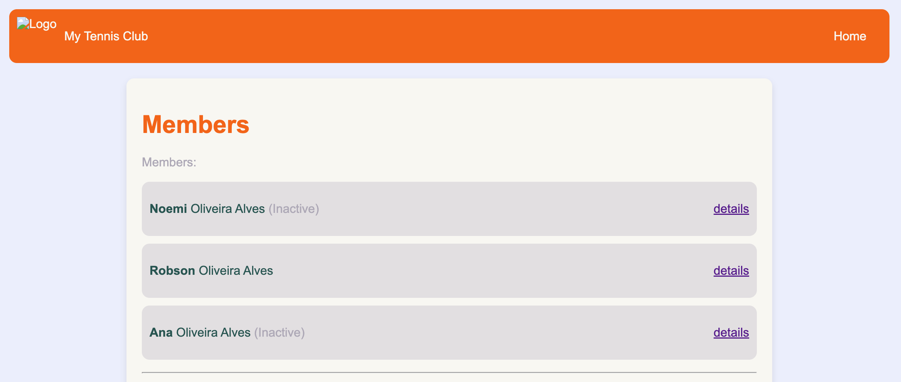

# Python Django Tennis Club

This is a Django-based web application for managing a tennis club. It includes features for managing members, scheduling matches, and tracking scores.




## Features

- Member Registration and Management
- Match Scheduling
- Score Tracking
- User Authentication

## Installation

1. Clone the repository:

    ```bash
    git clone git@github.com:olialvesrobson/python-django-tennis-club.git
    cd python-django-tennis-club
    ```

2. Create a virtual environment and activate it:

    ```bash
    python3 -m venv venv
    source venv/bin/activate  # On Windows use `venv\Scripts\activate`
    ```

3. Install the required packages:

    ```bash
    pip install -r requirements.txt
    ```

4. Apply migrations:

    ```bash
    python manage.py migrate
    ```

5. Create a superuser to access the admin site:

    ```bash
    python manage.py createsuperuser
    ```

6. Run the development server:

    ```bash
    python manage.py runserver
    ```

7. Open your web browser and go to `http://127.0.0.1:8000/` to see the application in action.

## Usage

### Member Registration and Management

Members can register on the site by filling out a registration form. Admins can manage member details through the Django admin interface.

Example:

```python
from django.contrib.auth.models import User

# Create a new user
user = User.objects.create_user('john', 'john@example.com', 'johnpassword')

# Update user details
user.first_name = 'John'
user.last_name = 'Doe'
user.save()
